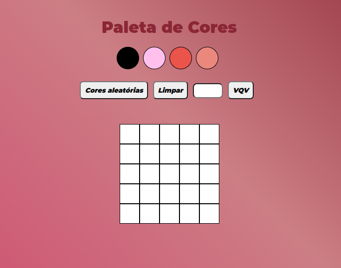

# :space_invader: Pixel-art :space_invader:

Projeto feito para a Trybe de manipulação de DOM e criação de elementos HTML pelo JavaScript.
[Link para acessar a página](https://alessandraromualdo.github.io/Pixel-art/)

### :pushpin: 1 - Adicione à página o título "Paleta de Cores".
### :pushpin: 2 - Adicione à página uma paleta contendo quatro cores distintas.
### :pushpin: 3 - Adicione a cor preta como a primeira cor da paleta de cores.
### :pushpin: 4 - Adicione um botão para gerar cores aleatórias para a paleta de cores.
### :pushpin: 5 - Implemente uma função usando localStorage para que a paleta de cores gerada aleatoriamente seja mantida após recarregar a página.
### :pushpin: 6 - Adicione à página um quadro contendo 25 pixels.
### :pushpin: 7 - Faça com que cada pixel do quadro tenha largura e altura de 40 pixels e borda preta de 1 pixel de espessura.
### :pushpin: 8 - Defina a cor preta como cor inicial da paleta de cores
### :pushpin: 9 - Crie uma função para selecionar uma cor na paleta de cores.
### :pushpin: 10 - Crie uma função que permita preencher um pixel do quadro com a cor selecionada na paleta de cores.
### :pushpin: 11 - Crie um botão que retorne a cor do quadro para a cor inicial.
### :pushpin: 12 - Crie uma função para salvar e recuperar o seu desenho atual no localStorage.